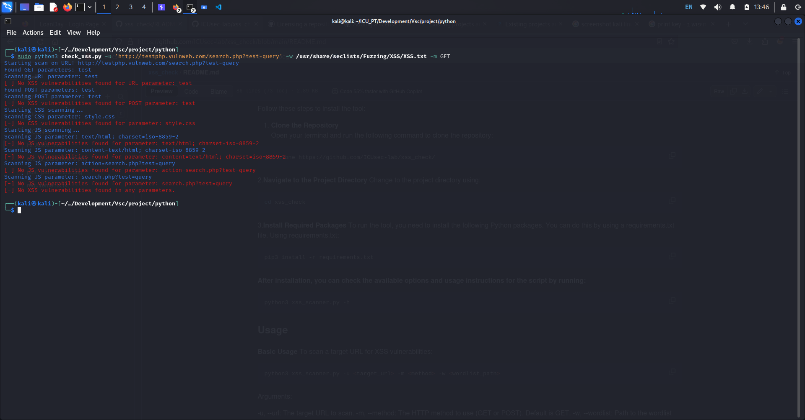
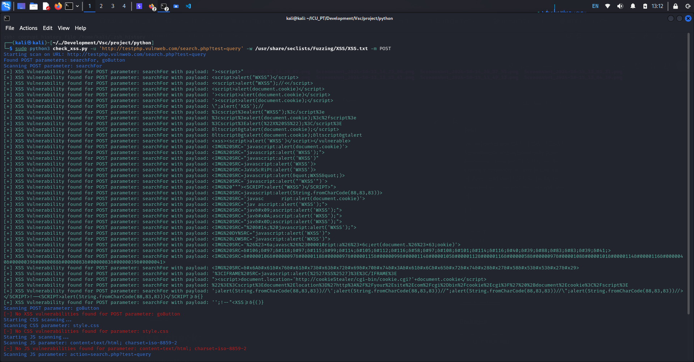
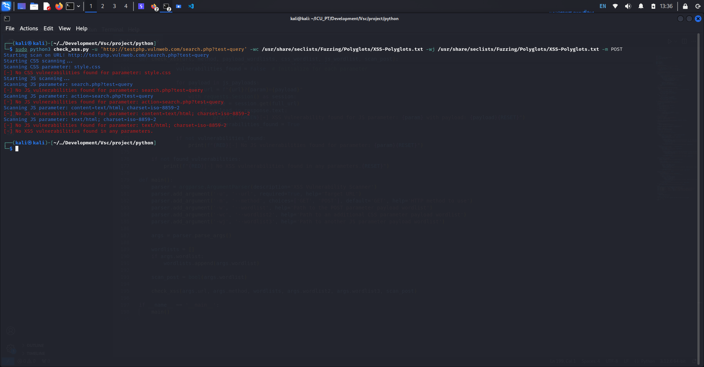
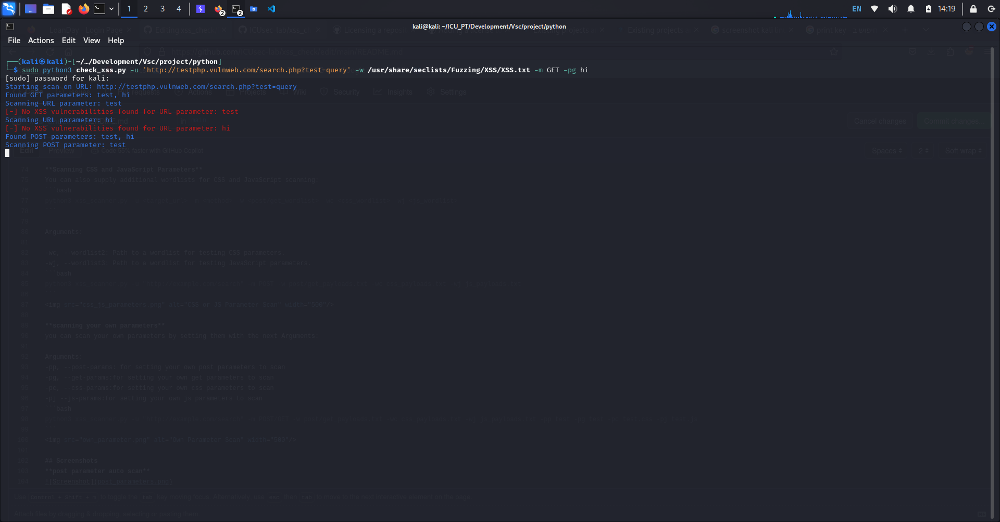

## Table of Contents
- [Introduction](#introduction)
- [Installation](#installation)
- [Usage](#usage)
- [Screenshots](#Screenshots)
- 
# xss_check:

## Introduction:
This tool can check GET / POST / CSS / JS parameters and automatically scan parameters. Read the README.md file for more information on how to use the tool. Also, read the LICENSE file to know what you can and can't do with the tool.

***XSS Vulnerability Scanner***
This tool is designed to scan for Cross-Site Scripting (XSS) vulnerabilities in GET and POST parameters, as well as scan for potential vulnerabilities in CSS and JavaScript parameters. It supports using multiple wordlists to test a wide range of payloads.

__Features__ 
- Automatically discover GET and POST parameters.
- Scans for XSS vulnerabilities in GET and POST requests.
- Scans for potential vulnerabilities in dynamic CSS and JavaScript parameters.
- Accepts multiple wordlists for payload testing.

## Installation
Follow these steps to install the tool:

1. **Clone the Repository**  
   Open your terminal and run the following command to clone the repository:
```bash
git clone https://github.com/ICUsec-lab/xss_check/
```
2.**Navigate to the Project Directory**
Change to the project directory using:
  ```bash
cd xss_check
```
3.**Install Required Packages**
To run the tool, you need to install the following Python packages. You can do this by using a requirements.txt file.
Using requirements.txt:
```bash
pip3 install -r requirements.txt
```

**After installation, you can check the available options and usage instructions for the script by running:**
```bash
python3 xss_scanner.py -h
```

## Usage
**Basic Usage**
To scan a target URL for XSS vulnerabilities:
```bash
python3 xss_scanner.py -u <target_url> -m <method> -w <wordlist_path>
```
Arguments:

-u, --url: The target URL to scan.
-m, --method: The HTTP method to use (GET or POST). Default is GET.
-w, --wordlist: Path to the wordlist file containing payloads for testing GET and POST parameters.

Example:
1.
```bash
python3 xss_scanner.py -u "http://example.com/search?q=test" -m GET -w payloads.txt
```


2.
```bash
python3 xss_scanner.py -u "http://example.com/" -m POST -w payloads.txt
```


**Scanning CSS and JavaScript Parameters**
You can also supply additional wordlists for CSS and JavaScript scanning:
```bash
python3 xss_scanner.py -u <target_url> -m <method> -w <post/get_wordlist> -wc <css_wordlist> -wj <js_wordlist>
```

Arguments:

-wc, --wordlist2: Path to a wordlist for testing CSS parameters.
-wj, --wordlist3: Path to a wordlist for testing JavaScript parameters.
```bash
python3 xss_scanner.py -u "http://example.com/search" -m POST -w post/get_payloads.txt -wc css_payloads.txt -wj js_payloads.txt
```


**scanning your own parameters**
you can scan your own parameters by setting them with the next Arguments:

Arguments:
-pp, --post-params: for setting your own post parameters to scan
-pg, --get-params:for setting your own get parameters to scan
-pc, --css-params:for setting your own css parameters to scan
-pj --js-params:for setting your own js parameters to scan
```bash
python3 xss_scanner.py -u "http://example.com/search" -m POST/GET -w post/get_payloads.txt -wc css_payloads.txt -wj js_payloads.txt -pp test -pg test -pc test.css -pj test.js
```


## Screenshots
**post parameter auto scan**


**css and js parameter auto scan**


**get parameter auto scan**


**own parameter scan**

